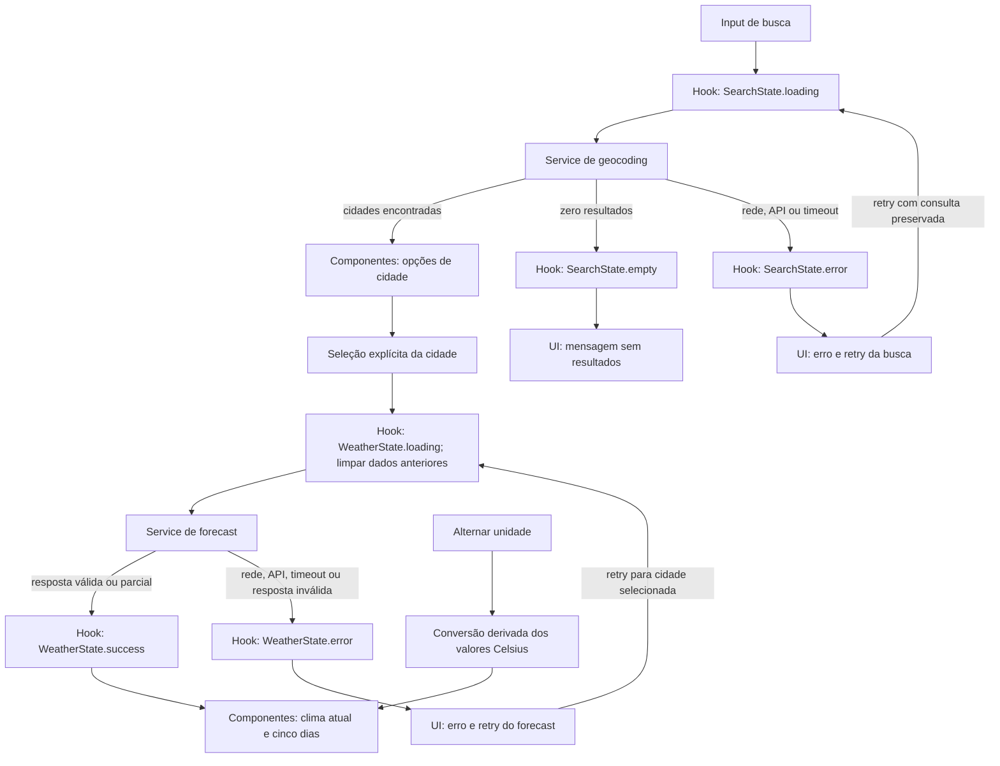

# Plano Técnico — Weather App

Este plano deriva de `specs/weather-app-spec.md`. A especificação é a fonte da verdade para o escopo e os critérios de aceite; este documento registra decisões e contratos para orientar as tarefas de implementação.

## Architecture

Aplicação SPA React com fluxo unidirecional e responsabilidades separadas, sem backend próprio:

- **Apresentação (`components/`)**: busca, resultados selecionáveis, condições atuais, previsão, unidade e estados de loading/erro/vazio. Recebe dados e callbacks; não contém regras de consulta nem faz chamadas HTTP.
- **Orquestração e estado (`hooks/`)**: `useWeather` coordena busca, seleção, carregamento, retry e estado meteorológico. Invalida operações anteriores para impedir que respostas obsoletas atualizem a interface.
- **Acesso a dados (`services/`)**: `weatherService` é responsável por chamadas Open-Meteo, parâmetros, timeout/abort, validação estrutural e normalização das respostas para os tipos internos. Não conhece componentes React.
- **Funções puras (`lib/`)**: conversão C/F, mapeamento WMO e formatação de datas/números em `pt-BR`; recebem valores e retornam resultados sem I/O ou estado global.
- **Contratos (`types/`)**: tipos compartilhados de cidade, clima e estados, sem comportamento ou dependências de runtime.

Direção das dependências: `components` → `hooks` → `services`; o hook e a apresentação podem usar funções de `lib/`, e serviços/hook/UI compartilham os tipos de `types/`. Serviços não importam UI, e funções puras não dependem de React nem da rede. Isso mantém a apresentação substituível e limita efeitos externos ao serviço.

Essa separação permite testar conversões e formatação com testes unitários determinísticos; testar serviços isoladamente com `fetch` controlado, cobrindo parâmetros e respostas; testar estados e concorrência do hook sem renderizar a aplicação inteira; e testar componentes com callbacks/fixtures para interações, acessibilidade e estados visuais. Playwright fica reservado aos fluxos integrados e responsividade.

O cliente consulta diretamente a Open-Meteo. Não há cache, persistência, analytics, localização automática, atualização em segundo plano ou registro em logs de consultas/coordenadas (FR-08 a FR-16, NFR-08, NFR-11).

## Requisitos Cobertos

| Escopo da spec | Cobertura no plano |
| --- | --- |
| FR-01 a FR-03, FR-07, FR-10 e FR-12 | `SearchBar`, `LocationResults`, `SearchState`, fluxo de geocoding e validação da consulta |
| FR-04, FR-05 e FR-14 | `CurrentWeather`, `ForecastList`, `WeatherData`, normalização parcial e apresentação de indisponibilidade |
| FR-06 e NFR-09 | `UnitToggle`, `Unit`, conversão local a partir de Celsius e teste de zero chamadas adicionais |
| FR-08, FR-11, FR-13 e NFR-07 | estados discriminados, timeout de 10 s, retry manual e feedback acessível |
| FR-15 | abortamento mais token de requisição para geocoding e forecast |
| FR-16 | aviso persistente junto à previsão, com a copy definida na spec |
| NFR-01 e NFR-10 | parâmetros fixos da Open-Meteo, códigos WMO, `lang="pt-BR"`, fuso local e formatação brasileira |
| NFR-02 e NFR-03 | controles semânticos, teclado, foco, contraste e viewports de 320, 768, 1024 e 1920 px |
| NFR-04 e NFR-06 | matriz de navegadores e medição separada de provedor/produto no gate de release |
| NFR-05, NFR-08 e NFR-11 | loading em até 200 ms, ausência de SLO do cliente no MVP e ausência de persistência/analytics/logs de consulta |

AC-01 a AC-16 são exercitados na combinação de testes unitários, de componentes/hook e E2E descrita em **Testing Strategy**. A tabela não substitui os critérios da spec; serve como verificação de que cada grupo tem uma decisão técnica e uma validação prevista.

## Tech Stack

| Área | Tecnologia | Decisão |
| --- | --- | --- |
| Linguagem e tipos | TypeScript strict | Contratos explícitos para respostas externas e dados parciais. |
| UI | React 19 + Vite | SPA cliente compatível com a base instalada; sem framework ou backend adicional. |
| Estilos | Tailwind CSS | Usar a configuração existente do projeto e manter o tema dark glassmorphism; layout responsivo de 320 a 1920 px. |
| Testes unitários/UI | Vitest, Testing Library, user-event | Testar funções puras, serviços com `fetch` controlado e interações acessíveis. |
| Testes E2E | Playwright | Validar fluxos completos, teclado, viewports e comportamento com respostas determinísticas. |
| Dados | Open-Meteo Geocoding e Forecast | APIs públicas sem chave de usuário; confirmar termos, limites e atribuição antes do release. |
| Gerenciador de pacotes | pnpm | Usar o gerenciador e scripts definidos no projeto. |
| Lint e formatação | Biome | Seguir scripts e configuração existentes do repositório. |

## Project Structure

Estrutura-alvo proposta para implementar as responsabilidades do MVP, sem criar camadas adicionais:

```text
src/
├── components/
│   ├── SearchBar.tsx          # entrada e envio da consulta
│   ├── LocationResults.tsx    # opções de cidade e interação por teclado
│   ├── CurrentWeather.tsx     # condições atuais
│   ├── ForecastList.tsx       # cinco dias de previsão
│   ├── UnitToggle.tsx         # seleção Celsius/Fahrenheit
│   └── FeedbackState.tsx      # loading, vazio e erro
├── hooks/
│   └── useWeather.ts          # orquestração e estado da experiência
├── services/
│   └── weatherService.ts      # geocoding, forecast e normalização
├── lib/
│   ├── temperature.ts         # conversão C/F
│   ├── weatherCodes.ts        # códigos WMO para rótulos
│   └── formatting.ts          # datas e números em pt-BR
├── types/
│   └── weather.ts             # contratos compartilhados
├── App.tsx                    # composição da tela
└── main.tsx                   # montagem da aplicação
```

Os testes permanecem fora de `src/`, em `tests/unit/` para funções e serviços, `tests/components/` para hook/UI e `tests/e2e/` para Playwright. Esses nomes são uma organização mínima proposta e não exigem abstrações extras. Cada componente React permanece em seu próprio arquivo, conforme a convenção do projeto.

## Data Model

Tipos internos normalizados; valores meteorológicos são mantidos em unidades da API (temperaturas em Celsius) e dados opcionais ausentes não recebem valores inventados.

```ts
type Unit = 'celsius' | 'fahrenheit';

interface City {
  id: number; // ID da localização no Geocoding API.
  name: string; // Nome da cidade retornado pelo provedor.
  latitude: number; // Latitude usada para consultar a previsão.
  longitude: number; // Longitude usada para consultar a previsão.
  region?: string; // Região ou estado (`admin1`), se disponível.
  country?: string; // País, se disponível.
}

interface CurrentWeather {
  temperatureC: number | undefined; // Temperatura atual em °C (`temperature_2m`).
  apparentTemperatureC: number | undefined; // Sensação térmica em °C (`apparent_temperature`).
  weatherCode: number | undefined; // Código WMO atual (`weather_code`).
  relativeHumidity: number | undefined; // Umidade relativa em % (`relative_humidity_2m`).
  precipitationMm: number | undefined; // Precipitação atual em mm (`precipitation`).
  pressureMslHpa: number | undefined; // Pressão ao nível do mar em hPa (`pressure_msl`).
  windSpeedKmh: number | undefined; // Velocidade do vento em km/h (`wind_speed_10m`).
}

interface ForecastDay {
  date: string; // Data local YYYY-MM-DD de `daily.time`.
  weatherCode: number | undefined; // Código WMO diário (`weather_code`).
  minimumTemperatureC: number | undefined; // Mínima em °C (`temperature_2m_min`).
  maximumTemperatureC: number | undefined; // Máxima em °C (`temperature_2m_max`).
  maximumPrecipitationProbability: number | undefined; // Probabilidade máxima em % (`precipitation_probability_max`).
}

interface WeatherData {
  city: City; // Cidade selecionada para esta consulta.
  timezone: string; // Fuso IANA retornado pela previsão (`timezone`).
  current: CurrentWeather; // Condições atuais retornadas pela API.
  forecast: ForecastDay[]; // Cinco dias locais em ordem, incluindo hoje.
}
```

**Contratos de normalização:** a resposta precisa ter estrutura compatível (incluindo cinco datas diárias); cada medição pode estar ausente e vira `undefined`. Um tipo/valor malformado ou arrays incompatíveis são erro de consulta. Código WMO desconhecido continua representado numericamente e é exibido como “Indisponível”. A UI apresenta campo ausente como “Indisponível”. Datas, cidade e fuso pertencem à mesma resposta selecionada.

## Data Flow

1. O usuário envia a busca pelo botão ou Enter. A UI rejeita texto vazio, mantém o foco e pede o nome da cidade; para consulta válida, remove apenas espaços externos.
2. `useWeather` marca geocoding como carregando e chama `searchCities(query)`. O serviço pede até cinco resultados, mantém a ordem do provedor e mapeia cada resultado para `City`.
3. A UI mostra resultados para seleção explícita, estado sem resultados ou erro com retry. O termo permanece no campo em caso de falha.
4. Ao selecionar uma cidade, o hook limpa imediatamente os dados meteorológicos anteriores e solicita a previsão pelas coordenadas selecionadas. A resposta é normalizada em `WeatherData` antes de atualizar a UI.
5. A apresentação mostra dados atuais e exatamente cinco datas locais. Trocar a unidade deriva todos os valores de temperatura a partir dos valores Celsius originais, sem chamadas de rede.
6. Nova busca, seleção ou retry invalida operações anteriores. AbortController cancela quando possível; um identificador de requisição impede que uma resposta tardia altere a interface.



## External APIs

### Contrato do serviço

O módulo `weatherService` expõe somente operações assíncronas independentes de React:

```ts
searchCities(query: string, signal?: AbortSignal): Promise<City[]>;
getWeather(city: City, signal?: AbortSignal): Promise<WeatherData>;
```

O serviço monta as URLs com `URLSearchParams`, aplica o timeout de 10 segundos, verifica status HTTP e valida o JSON antes de normalizar. O `signal` permite ao hook cancelar a operação substituída; abortamentos de concorrência não são convertidos em mensagens de erro. O serviço não registra a consulta, coordenadas ou resposta.

### Geocoding

```http
GET https://geocoding-api.open-meteo.com/v1/search
    ?name={query}&count=5&language=pt&format=json
```

`name` recebe a consulta normalizada; `count=5`, `language=pt` e `format=json` limitam a cinco opções, pedem nomes em português e JSON.

Exemplo resumido de resposta:

```json
{
  "results": [
    {
      "id": 3448439,
      "name": "São Paulo",
      "latitude": -23.5475,
      "longitude": -46.6361,
      "admin1": "São Paulo",
      "country": "Brasil"
    }
  ]
}
```

Mapeamento para `City`: `id`, `name`, `latitude` e `longitude` são obrigatórios; `admin1` vira `region` e `country` vira `country`, ambos opcionais. Descartar IDs repetidos mantendo a primeira ocorrência e a ordem do provedor; apresentar no máximo cinco opções únicas, sem selecionar automaticamente. Uma lista `results` vazia significa nenhuma cidade encontrada; falha HTTP, rede, timeout ou estrutura inválida é erro de geocoding.

### Forecast

```http
GET https://api.open-meteo.com/v1/forecast
    ?latitude={latitude}&longitude={longitude}
    &current=temperature_2m,apparent_temperature,relative_humidity_2m,weather_code,precipitation,pressure_msl,wind_speed_10m
    &daily=weather_code,temperature_2m_min,temperature_2m_max,precipitation_probability_max
    &timezone=auto&forecast_days=5&temperature_unit=celsius
    &wind_speed_unit=kmh&precipitation_unit=mm
```

O grupo `current` pede condições atuais; `daily` pede código WMO, mínima/máxima e probabilidade máxima de precipitação para cada dia. `timezone=auto` solicita o fuso local das coordenadas; `forecast_days=5` inclui hoje e os quatro dias seguintes. As unidades são fixadas por `temperature_unit=celsius`, `wind_speed_unit=kmh` e `precipitation_unit=mm`.

Exemplo resumido de resposta (os arrays diários correspondem por índice):

```json
{
  "timezone": "America/Sao_Paulo",
  "current": {
    "temperature_2m": 18.5,
    "apparent_temperature": 17.2,
    "relative_humidity_2m": 70,
    "weather_code": 3,
    "precipitation": 0.2,
    "pressure_msl": 1013.2,
    "wind_speed_10m": 10
  },
  "daily": {
    "time": ["2026-09-30", "2026-10-01", "2026-10-02", "2026-10-03", "2026-10-04"],
    "weather_code": [3, 2, 61, 1, 0],
    "temperature_2m_min": [14.1, 15.0, 13.8, 14.2, 16.0],
    "temperature_2m_max": [22.4, 24.0, 19.5, 23.1, 25.2],
    "precipitation_probability_max": [10, 20, 80, 15, 0]
  }
}
```

Mapeamento para `WeatherData`: associar a `City` selecionada e copiar `timezone` para `WeatherData.timezone`. Mapear `current.temperature_2m` → `temperatureC`, `apparent_temperature` → `apparentTemperatureC`, `weather_code` → `weatherCode`, `relative_humidity_2m` → `relativeHumidity`, `precipitation` → `precipitationMm`, `pressure_msl` → `pressureMslHpa` e `wind_speed_10m` → `windSpeedKmh`. Para cada índice `i` de `daily.time`, criar um `ForecastDay`: `time[i]` → `date`, `weather_code[i]` → `weatherCode`, `temperature_2m_min[i]` → `minimumTemperatureC`, `temperature_2m_max[i]` → `maximumTemperatureC` e `precipitation_probability_max[i]` → `maximumPrecipitationProbability`. Preservar a ordem da API e o fuso local; não converter ou arredondar temperaturas durante a normalização.

Campos meteorológicos opcionais ausentes ou `null` em resposta estruturalmente válida viram `undefined`. Se um array diário opcional inteiro estiver ausente, seus cinco valores normalizados ficam indisponíveis; `null` em um índice também vira `undefined`, preservando a data daquele índice. Exigir cinco datas válidas em `daily.time`; arrays métricos presentes devem ter o mesmo comprimento. Tipo incompatível, data ausente/inválida ou comprimento divergente é resposta malformada e erro, não resposta parcial. O cliente não envia segredo ou chave.

Cada chamada tem timeout de 10 segundos. Erro HTTP, rede, timeout ou JSON/estrutura incompatível vira erro recuperável; campos individualmente ausentes em estrutura válida permanecem indisponíveis.

## State Management

O estado da experiência vive localmente no hook `useWeather`, sem biblioteca externa ou persistência. A busca e a previsão têm estados discriminados separados: `empty` representa uma busca concluída sem cidades; antes de selecionar uma cidade, o estado meteorológico é `idle`. Assim, ausência de resultados não se confunde com erro, e loading/erro de geocoding não apaga a consulta digitada.

```ts
type SearchState =
  | { status: 'idle' }
  | { status: 'loading'; query: string }
  | { status: 'success'; query: string; cities: City[] }
  | { status: 'empty'; query: string }
  | { status: 'error'; query: string; message: string };

type WeatherState =
  | { status: 'idle' }
  | { status: 'loading'; city: City }
  | { status: 'success'; data: WeatherData }
  | { status: 'error'; city: City; message: string };
```

`SearchState` percorre `idle → loading → success | empty | error`; nova busca/retry retorna a `loading`. `WeatherState` percorre `idle → loading → success | error`; seleção/retry inicia uma consulta e sucesso ou falha a encerra. Em nova seleção, limpar imediatamente os dados anteriores. O hook mantém a consulta e cidade selecionada para retry e `unit: Unit`, inicializada em Celsius.

Ao iniciar uma nova busca, a consulta normalizada passa a ser o contexto ativo do geocoding; a cidade selecionada pode continuar identificada até uma nova seleção, mas nenhuma resposta de forecast associada a uma ação invalidada pode alterar a interface. Cada família de operação mantém seu próprio token de requisição, para que uma busca nova e um retry de forecast não compartilhem um contador acidentalmente.

`unit` é estado de apresentação; `WeatherData` mantém temperaturas Celsius originais sem arredondamento. Durante a renderização, uma função pura deriva os valores visíveis: Celsius mantém o valor e Fahrenheit calcula $F = C \times 9/5 + 32$; formatar o resultado com uma casa decimal. Alternar a unidade não altera os dados normalizados nem dispara requests de geocoding ou forecast.

## Error Handling

- **Entrada vazia:** não enviar request; manter o campo disponível e pedir um nome de cidade.
- **Sem resultados de geocoding:** transicionar para `SearchState.empty`, informar que nenhuma cidade foi encontrada e manter a consulta editável; não solicitar forecast.
- **Falha de rede:** tratar rejeição de `fetch`/offline como `error`; encerrar loading, preservar consulta ou cidade selecionada e oferecer retry manual, sem cache ou dados antigos.
- **Erro da API:** resposta HTTP não bem-sucedida ou payload de erro do provedor vira `error`, não `empty`. Preservar contexto e disponibilizar retry manual.
- **Timeout:** limitar cada request a 10 s com `AbortController`; encerrar loading e apresentar o erro correspondente com retry manual. Um abort causado por busca/seleção substituta é obsoleto e não deve aparecer como erro.
- **Resposta parcial válida:** para estrutura compatível, manter cada valor meteorológico recebido e representar cada campo ausente como `undefined`; exibir “Indisponível”. Nunca completar com valores inventados ou de uma consulta anterior.
- **Resposta inválida:** JSON malformado, estrutura incompatível ou arrays diários incompatíveis são erro recuperável, não resposta parcial; não apresentar dados como sucesso.
- **Retry:** somente por ação explícita. Geocoding reenvia a consulta preservada; forecast repete para a cidade selecionada. Falha repetida permanece visível com nova tentativa disponível.
- **Concorrência:** abortar operações substituídas quando possível e validar token de requisição antes de atualizar estado; respostas tardias não alteram busca, cidade ou clima atuais.
- **Acessibilidade, localização e segurança:** loading usa `role="status"`, erros usam região de alerta acessível; declarar `lang="pt-BR"`, manter todos os textos visíveis e descrições WMO em pt-BR, formatar datas no fuso IANA e horas em 24 h quando exibidas. Consultas e mensagens são texto literal, nunca HTML interpretável. Não registrar consulta ou coordenadas em logs; exibir junto à previsão o aviso exato: “Este app não fornece alertas meteorológicos severos. Consulte os serviços oficiais da sua região para avisos.”

## Testing Strategy

- **Funções puras (Vitest):** conversão C/F a partir de Celsius não arredondado (incluindo 0 °C → 32 °F e 100 °C → 212 °F), precisão de uma casa decimal na apresentação, códigos WMO conhecidos/desconhecidos e formatação de datas/números em `pt-BR` no fuso IANA.
- **Services (Vitest):** mock de `fetch` para confirmar URL/parâmetros de geocoding e forecast; cobrir resultado válido, IDs repetidos e lista vazia, resposta HTTP de erro, rejeição de rede, timeout em 10 s, abortamento, JSON/estrutura inválidos e campos ausentes/nulos. Não depender do serviço externo nos testes automatizados.
- **Componentes e hook (Vitest + Testing Library):** renderizar e verificar estados `loading`, erro, vazio e sucesso; testar envio por Enter/botão, navegação de resultados por setas, seleção por Enter e dispensa por Escape, retry, campos indisponíveis, limpeza da cidade anterior e concorrência. Com relógio controlado, verificar loading visível até 200 ms após o envio; com contador de `fetch`, alternar unidade dez vezes e confirmar zero chamadas adicionais.
- **Fluxos E2E (Playwright):** cobrir busca → seleção de cidade → condições atuais e cinco dias → troca C/F → nova busca; incluir falha/retry e resposta parcial usando `page.route` com fixtures determinísticas, evitando flakiness por rede/provedor. Verificar `lang="pt-BR"`, texto visível em pt-BR e o aviso de segurança com a copy definida na spec.
- **Viewport mobile e acessibilidade (Playwright + revisão manual):** validar ao menos 320 px e 768 px, além de 1024 px e 1920 px, sem rolagem horizontal. Cobrir setas/Enter/Escape, foco visível, labels da busca e unidade, `role="status"`/alerta e contraste WCAG 2.2 AA de forma automatizada e manual.
- **Compatibilidade e desempenho:** registrar, no congelamento do release, as duas versões estáveis mais recentes de Chrome, Edge, Firefox e Safari e os dispositivos usados na validação manual. Playwright cobre Chromium, Firefox e WebKit em CI; Safari real permanece uma verificação manual quando não estiver disponível no ambiente Linux. Medir separadamente latência do provedor e do produto; verificar meta p95 de até 3 s quando o provedor responde em até 2,5 s, com ambiente/rede aprovados antes do release.
- **Gates do repositório:** antes de concluir a implementação, executar `pnpm lint`, `pnpm build` e `pnpm test`; executar também `pnpm test:e2e` para validar a suíte Playwright.

## Risks & Trade-offs

| Risco ou decisão | Tratamento / trade-off |
| --- | --- |
| Disponibilidade, latência, limites e mudança de contrato da Open-Meteo | Timeout, validação, erros e retry manual; sem cache ou provedor alternativo no MVP. Confirmar condições de uso, limites e atribuição antes da publicação. |
| Respostas parciais ou arrays diários desalinhados | Normalizar campo a campo, validar datas/arrays e falhar em estruturas incompatíveis para não associar valor à data errada. |
| Respostas antigas sobrescreverem a seleção atual | Abortamento mais token de requisição; cancelamento sozinho não é suficiente se a resposta já tiver sido resolvida. |
| Conversão local de temperatura | Manter Celsius não arredondado como fonte e converter somente na apresentação; evita novas chamadas e divergência entre unidades. |
| Sem persistência, cache ou funcionamento offline | Escopo e privacidade mais simples; uma falha de rede impede consulta e não há dados antigos mostrados como atuais. |
| Metas de performance dependem da rede e do provedor | Separar tempos externos e internos e aprovar conjunto/ambiente de medição antes de usar a meta de release. |
| Previsão básica confundida com alerta severo | Aviso persistente junto à previsão direciona a fontes oficiais; o produto não promete cobertura de alertas. |
| Personas e métricas ainda são hipóteses | Validar discovery com usuários antes de ampliar escopo; isso não bloqueia implementar o MVP especificado. |
| Disponibilidade operacional não definida | O cliente não tem SLO ponta a ponta nem serviço próprio; hospedagem, monitoramento e meta operacional ficam para decisão pós-MVP. |

### Decisões e alternativas consideradas

| Decisão | Alternativa considerada | Trade-off adotado |
| --- | --- | --- |
| Estado local no hook `useWeather`, sem biblioteca externa | Redux/Zustand ou estado global | Menos dependências e cerimônia para uma única tela/fluxo; reconsiderar apenas se o estado compartilhado crescer. |
| Browser consulta Open-Meteo diretamente | Backend/proxy próprio | Mantém implantação e arquitetura simples, sem segredo de API; aceita dependência de rede/provedor e exige confirmar termos/limites antes do release. |
| Manter temperaturas em Celsius e derivar Fahrenheit na renderização | Pedir outra unidade à API ao alternar | Evita requests e estado duplicado; requer conversão/formatador local testado. |
| Sem cache ou persistência no MVP | Cache local, histórico ou dados offline | Evita apresentar dados antigos como atuais e reduz retenção de dados; consultas exigem rede e novo carregamento. |
| Abortamento junto a token de requisição | Apenas cancelar requests | O token também descarta respostas que já concluíram ou não puderam ser canceladas; acrescenta controle simples no hook. |
| Fixtures/mock de rede em Vitest e Playwright | Testes automatizados dependentes da API real | Resultados determinísticos e execução sem rede; latência/disponibilidade real é avaliada separadamente nos testes de desempenho/release. |